# 👋 Olá, eu sou James Johny
Estudante de Ciência da Computação e apaixonado por tecnologia 
## 🚀 Estatísticas do GitHub

<!-- GitHub Metrics -->

---

## 🛠️ Tecnologias e Ferramentas

### Linguagens

### Banco de Dados

### Ferramentas

---

# Desafios de Projeto

- [trilha-react-desafio01-calculadora](https://github.com/James-Johny/trilha-react-desafio01-calculadora)
  Calculadora desenvolvida em React

- [js-developer-portfolio](https://github.com/James-Johny/js-developer-portfolio)  
  Portfólio de desenvolvedor em JavaScript, com foco em apresentação de projetos e habilidades.

- [hbommax](https://github.com/James-Johny/hbommax)  
  Clone da interface da HBO Max, utilizando HTML, CSS e JavaScript para praticar front-end.

- [discord](https://github.com/James-Johny/discord)  
  Projeto inspirado no Discord, recriando layout e funcionalidades básicas de interface.

- [calc-ruby](https://github.com/James-Johny/calc-ruby)  
  Calculadora desenvolvida em Ruby, exercitando lógica de programação e sintaxe da linguagem.

- [yt-grid](https://github.com/James-Johny/yt-grid)  
  Layout estilo YouTube utilizando CSS Grid, para treinar posicionamento e responsividade.

- [yt-flexbox](https://github.com/James-Johny/yt-flexbox)  
  Layout estilo YouTube utilizando Flexbox, explorando alinhamento e distribuição de elementos.

- [js-developer-pokedex](https://github.com/James-Johny/js-developer-pokedex)  
  Pokedex interativa em JavaScript, consumindo dados de API e exibindo informações de Pokémon.

- [trilha-css-desafio-01](https://github.com/James-Johny/trilha-css-desafio-01)  
  Exercício da trilha CSS da DIO, aplicando estilos e boas práticas de design.

- [trilha-html-modulo-3](https://github.com/James-Johny/trilha-html-modulo-3)  
  Projeto da trilha HTML da DIO, módulo 3, com foco em estruturação semântica.

- [desafio-html-dio](https://github.com/James-Johny/desafio-html-dio)  
  Desafio prático de HTML da DIO, reforçando conceitos básicos de marcação.

- [desafio-felipao-2](https://github.com/James-Johny/desafio-felipao-2)  
  Exercício de lógica de programação proposto pelo instrutor Felipão, versão 2.

- [desafio-felipao](https://github.com/James-Johny/desafio-felipao)  
  Primeira versão do desafio de lógica de programação do instrutor Felipão.

---
## 🌐 Redes Sociais

